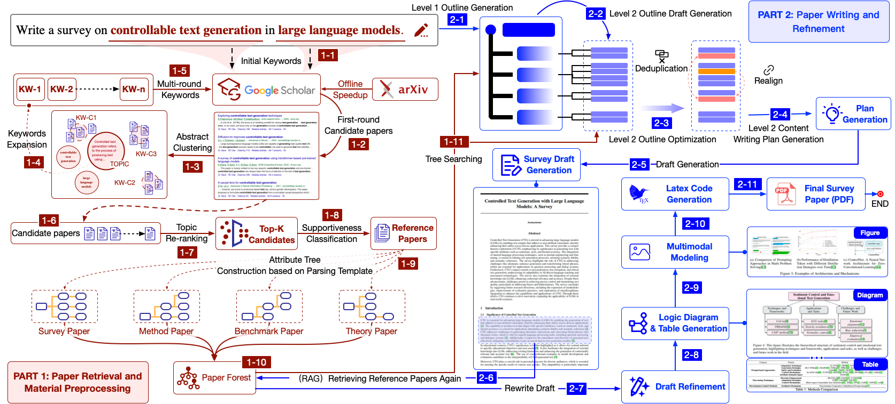

<h2 align="center">SurveyX: Academic Survey Automation via Large Language Models</h2>

<p align="center">
  <i>
✨Welcome to SurveyX Enhanced Version! This repository includes online arXiv search, multimodal processing, CoT & Multi-Agent generation, and more advanced features. For the full commercial version, please visit our website.✨
  </i>
  <br>
  <a href="https://arxiv.org/abs/2502.14776">
      
  </a>
  <a href="http://www.surveyx.cn">
    
  </a>
  <a href="https://huggingface.co/papers/2502.14776">
    
  </a>
  <a href="https://github.com/IAAR-Shanghai/SurveyX">
    
  </a>
    
  </a>
  <br>
  <a href="https://github.com/IAAR-Shanghai/SurveyX/blob/main/assets/user_groups_123.jpg">
    
  </a>
</p>

<div align="center">
    <strong><a>If you find our work helpful, don't forget to give us a star! ⭐️</a></strong>
    <br>
  👉 <strong><a href="https://surveyx.cn/">Visit SurveyX</a></strong> 👈
</div>

\[English | [中文](README_zh.md)\]

## 🤔What is SurveyX?



**SurveyX** is an advanced academic survey automation system that leverages the power of Large Language Models (LLMs) to generate high-quality, domain-specific academic papers and surveys. By simply providing a paper title and keywords for literature retrieval, users can request comprehensive academic papers or surveys tailored to specific topics.

---

## 🆕 Enhanced Version - New Features

This repository is an **enhanced version** based on the original SurveyX baseline, incorporating significant improvements and new capabilities:

### ✨ New Features Compared to Baseline SurveyX

#### 1. **🔍 Online arXiv Search**
- **Real-time paper retrieval** from arXiv using the official arXiv API
- Automatic extraction of paper metadata, abstracts, and full-text content
- Support for batch processing and rate limit handling
- HTML and LaTeX source parsing for comprehensive content extraction
- **Implementation**: `src/modules/preprocessor/data_fetcher_arxiv_alternative.py`

#### 2. **🖼️ Multimodal Document Processing**
- **Image understanding and processing** capabilities
- Support for both image URLs and local image files
- Integration with vision-language models for multimodal content generation
- Automatic figure extraction and caption generation from PDF documents
- **Implementation**: Enhanced `ChatAgent` with `image_urls` and `local_images` support

#### 3. **🌳 Attribute Tree Extraction**
- **Structured attribute extraction** from academic papers
- Automatic classification of paper types (method, benchmark, survey, theory)
- Hierarchical attribute tree generation for different paper categories
- Enhanced fact verification using attribute tree data
- **Implementation**: `src/modules/preprocessor/data_cleaner.py` with `get_attri()` method, integrated in `multi_agent_generator.py`

#### 4. **🧠 Chain-of-Thought (CoT) & Multi-Agent Generation**
- **Writer-Critic verification loop** for high-quality content generation
- Multi-agent architecture with specialized roles:
  - **Writer Agent**: Creative content generation with higher temperature
  - **Critic Agent**: Strict fact/logic verification with lower temperature
  - **Planner Agent**: Strategic content planning and organization
- Iterative refinement based on critic feedback
- Attribute tree-based fact verification
- **Implementation**: `src/models/generator/multi_agent_generator.py`
- **Usage**: Enable with `--cot` flag in `offline_run.py`

#### 5. **🛡️ System Resilience and Robustness**
- **Comprehensive error handling** with automatic retry mechanisms
- Rate limit handling and exponential backoff for API calls
- Graceful degradation when optional dependencies are missing
- Robust exception handling across all modules
- **Retry decorators** using `tenacity` library for critical operations
- Automatic recovery from transient failures
- **Implementation**: Extensive use of `@retry` decorators and try-except blocks throughout the codebase

#### 6. **📚 Citation and Reference Integrity**
- **Automatic citation validation** and repair
- Fuzzy matching for incorrect citation names
- BibTeX entry completion and enhancement using LLM
- Reference integrity checking between citations and bibliography
- Automatic replacement of invalid citations with closest matches
- Comprehensive citation statistics and reporting
- **Implementation**: 
  - `src/modules/heuristic_modules/map_cited_bib_names_to_refs.py` for citation validation
  - `src/modules/post_refine/rag_refiner.py` for citation enhancement
  - `src/modules/preprocessor/data_cleaner.py` for BibTeX completion

#### 7. **🔧 LaTeX Error Auto-Fixing**
- **Automatic LaTeX compilation error detection and repair**
- Intelligent parsing of LaTeX error logs
- LLM-powered error fixing suggestions
- Multiple fix attempts with progressive refinement
- **Implementation**: `src/modules/latex_handler/latex_error_fixer.py`

---

## 🌿 Branch Overview

This repository contains multiple branches, each with different features and capabilities:

| Branch | Description | Key Features |
|--------|-------------|--------------|
| **`main`** | **Baseline SurveyX** | Original SurveyX implementation, basic survey generation capabilities |
| **`multimodal`** | Multimodal Extension | Adds image understanding and processing capabilities to the baseline |
| **`arxiv_search`** | arXiv Search Extension | Adds real-time arXiv paper retrieval and online search functionality |
| **`cot`** | CoT & Multi-Agent Extension | Adds Chain-of-Thought reasoning and Multi-Agent Writer-Critic architecture |
| **`final_merged`** | **Complete Enhanced Version** ⭐ | **All features merged**: arXiv search + Multimodal + CoT & Multi-Agent + Attribute Tree + System Resilience + Citation Integrity |

### Branch Details

#### `main` - Baseline SurveyX
- Original SurveyX baseline implementation
- Basic survey generation from local markdown references
- Standard content generation pipeline

#### `multimodal` - Multimodal Extension
- **Based on**: `main`
- **Adds**: Image understanding and processing
- Enhanced `ChatAgent` with `image_urls` and `local_images` support
- Automatic figure extraction from PDF documents

#### `arxiv_search` - arXiv Search Extension
- **Based on**: `multimodal`
- **Adds**: Online arXiv paper retrieval
- `data_fetcher_arxiv_alternative.py` for real-time paper search
- HTML and LaTeX source parsing
- Rate limit handling and batch processing

#### `cot` - CoT & Multi-Agent Extension
- **Based on**: `multimodal`
- **Adds**: 
  - Chain-of-Thought (CoT) reasoning
  - Multi-Agent Writer-Critic verification loop
  - Attribute Tree extraction and fact verification
  - LaTeX error auto-fixing
  - Enhanced citation integrity
- `multi_agent_generator.py` for high-quality content generation
- `latex_error_fixer.py` for automatic LaTeX error repair

#### `final_merged` - Complete Enhanced Version ⭐
- **Based on**: `cot` (which includes multimodal features)
- **Adds**: arXiv search functionality from `arxiv_search` branch
- **Complete feature set**:
  - ✅ Online arXiv search
  - ✅ Multimodal document processing
  - ✅ Attribute Tree extraction
  - ✅ CoT & Multi-Agent generation
  - ✅ System resilience and robustness
  - ✅ Citation and reference integrity
  - ✅ LaTeX error auto-fixing
- **Recommended for**: Production use and full feature access

### Which Branch Should I Use?

- **For basic usage**: Use `main` (baseline SurveyX)
- **For image processing**: Use `multimodal`
- **For online paper search**: Use `arxiv_search`
- **For high-quality generation**: Use `cot`
- **For all features**: Use `final_merged` ⭐ (recommended)

---

## 🆚 Enhanced Version vs. Original Baseline

This enhanced version includes significant improvements over the original SurveyX baseline:

**New capabilities in this enhanced version:**
1. ✅ **Real-time arXiv search:** Direct integration with arXiv API for online paper retrieval (via `data_fetcher_arxiv_alternative.py`)
2. ✅ **Multimodal document parsing:** Full support for image understanding and processing in generated surveys
3. ✅ **CoT & Multi-Agent generation:** High-quality mode with Writer-Critic verification loop
4. ✅ **Attribute Tree extraction:** Structured attribute extraction for enhanced fact verification
5. ✅ **System resilience:** Comprehensive error handling and automatic recovery mechanisms
6. ✅ **Citation integrity:** Automatic citation validation, repair, and BibTeX enhancement

**Note:** For the full commercial version with additional features (paper database, advanced keyword expansion, dual-layer semantic filtering), please visit [our website](https://www.surveyx.cn).

---

## 🛠️ How to Use the Offline Open Source Version (This repo)

### 1. Prerequisites

- Python 3.10+ (Anaconda recommended)
- All Python dependencies in `requirements.txt`
- LaTeX environment (for PDF compilation):
- You need to convert all your reference documents to Markdown (`.md`) format and put them together in a single folder before running the pipeline.

```bash
sudo apt update && sudo apt install texlive-full
```

### 2. Installation

1. Clone the repository:
```bash
git clone https://github.com/PhoenixGS/SurveyX.git
cd SurveyX
```

2. Install Python dependencies:

**CPU 版本（基础）：**
```bash
pip install -r requirements.txt
```

**Note:** The enhanced version includes additional dependencies for new features:
- `arxiv`: For online arXiv paper search
- `beautifulsoup4`: For HTML parsing in arXiv search
- `tenacity`: For retry mechanisms and system resilience
- All dependencies are already included in `requirements.txt`

**CUDA/GPU 版本 (extension)：**
```bash
# 1. 安装基础依赖
pip install -r requirements.txt

# 2. 安装 PyTorch (根据你的 CUDA 版本选择)
# CUDA 12.1:
pip install torch torchvision torchaudio --index-url https://download.pytorch.org/whl/cu121

# CUDA 11.8:
pip install torch torchvision torchaudio --index-url https://download.pytorch.org/whl/cu118

# 3. 安装 transformers (如果未自动安装)
pip install transformers sentence-transformers
```

### 3. LLM Configuration

Edit `src/configs/config.py` to provide your LLM API URL, token, and model information before running the pipeline.

#### Single API Key
```bash
export PARATERA_API_KEY="your-paratera-api-key"
```

#### Multiple API Keys (Load Balancing - Recommended for Testing)
To avoid rate limiting and improve performance, you can configure multiple API keys. The system will randomly select one for each request:

**Method 1: Environment Variable (Recommended)**
```bash
export PARATERA_API_KEYS="sk-key1,sk-key2,sk-key3"
```

**Method 2: Default Configuration**
The system is pre-configured with two API keys by default in `config.py`. You can modify `PARATERA_API_KEYS` in the config file.

**Benefits:**
- ✅ Automatic load balancing across multiple keys
- ✅ Reduces rate limiting issues
- ✅ Faster processing for large-scale testing
- ✅ Thread-safe random selection

Example:
```python
REMOTE_URL = "https://llmapi.paratera.com/v1/chat/completions"
# Single key
TOKEN = "sk-xxxx..."
# Multiple keys (automatically used for load balancing)
PARATERA_API_KEYS = ["sk-key1", "sk-key2", "sk-key3"]
DEFAULT_EMBED_ONLINE_MODEL = "BAAI/bge-base-en-v1.5"
EMBED_REMOTE_URL = "https://api.siliconflow.cn/v1/embeddings"
EMBED_TOKEN = "your embed token here"
```

### 4. Workflow
转化为md文件
```bash 
python scripts/convert_ref_to_md.py eval/data/ref references/LLMs_for_Recommendation "LLMs for Recommendation"
```
Each run creates a unique result folder under `outputs/`, named by the task id `outputs/<task_id>` (e.g., `outputs/2025-06-18-0935_keyword/`).

Run the full pipeline:

**Basic mode (original SurveyX behavior):**
```bash
python tasks/offline_run.py --title "Your Survey Title" --key_words "keyword1, keyword2, ..." --ref_path "path/to/your/reference/dir"
```

**High-quality mode with CoT & Multi-Agent (recommended):**
```bash
python tasks/offline_run.py --title "Your Survey Title" --key_words "keyword1, keyword2, ..." --ref_path "path/to/your/reference/dir" --quality_mode high --cot
```

**Using online arXiv search (new feature):**
```bash
# The system will automatically use arXiv search if data_fetcher_arxiv_alternative.py is available
# Make sure to install: pip install arxiv beautifulsoup4
python tasks/offline_run.py --title "Your Survey Title" --key_words "keyword1, keyword2, ..." --use_arxiv_search
```

**Device Selection (CPU/GPU):**

You can control which device to use for embedding models:

```bash
# Use CPU explicitly:
python tasks/offline_run.py --title "Your Title" --key_words "keywords" --ref_path "references" --device cpu

# Use specific GPU (e.g., GPU 0):
python tasks/offline_run.py --title "Your Title" --key_words "keywords" --ref_path "references" --device cuda --gpu_ids "0"
# Auto-detect (default, will use GPU if available):
python tasks/offline_run.py --title "Your Title" --key_words "keywords" --ref_path "references" --device auto
```

**Note:** 
- `--device` options: `auto` (default), `cpu`, or `cuda`
- `--gpu_ids`: Specify GPU device ID(s), e.g., `"0"` or `"0,1,2"` (currently uses the first GPU if multiple are specified)
- Using GPU can significantly speed up embedding operations (10-50x faster)

Or run step by step:
```bash
export task_id="your_task_id"
python tasks/workflow/03_gen_outlines.py --task_id $task_id
python tasks/workflow/04_gen_content.py --task_id $task_id
python tasks/workflow/05_post_refine.py --task_id $task_id
python tasks/workflow/06_gen_latex.py --task_id $task_id
```

**Note:** Your local reference documents **must be in Markdown (`.md`) format** and placed in a single directory.

### 5. Output

- All results are saved under `outputs/<task_id>/`
  - `survey.pdf`: Final compiled survey
  - `outlines.json`: Generated outline
  - `latex/`: LaTeX sources
  - `tmp/`: Intermediate files

---

## Example Papers

| Title                                                        | Keywords                                                     |
| ------------------------------------------------------------ | ------------------------------------------------------------ |
|[A Survey of NoSQL Database Systems for Flexible and Scalable Data Management](./examples/Database/A_Survey_of_NoSQL_Database_Systems_for_Flexible_and_Scalable_Data_Management.pdf) | NoSQL, Database Systems, Flexibility, Scalability, Data Management |
|[Vector Databases and Their Role in Modern Data Management and Retrieval A Survey](./examples/Database/Vector_Databases_and_Their_Role_in_Modern_Data_Management_and_Retrieval_A_Survey.pdf) | Vector Databases, Data Management, Data Retrieval, Modern Applications |
|[Graph Databases A Survey on Models, Data Modeling, and Applications](./examples/Database/Graph_Databases_A_Survey_on_Models.pdf) | Graph Databases, Data Modeling |
|[A Survey on Large Language Model Integration with Databases for Enhanced Data Management and Survey Analysis](./examples/Database/A_Survey_on_Large_Language_Model_Integration_with_Databases_for_Enhanced_Data_Management_and_Survey_Analysis.pdf) | Large Language Models, Database Integration, Data Management, Survey Analysis, Enhanced Processing |
|[A Survey of Temporal Databases Real-Time Databases and Data Management Systems](./examples/Database/A_Survey_of_Temporal_Databases_Real.pdf) | Temporal Databases, Real-Time Databases, Data Management |
| [From BERT to GPT-4: A Survey of Architectural Innovations in Pre-trained Language Models](./examples/Computation_and_Language/Transformer.pdf) | Transformer, BERT, GPT-3, self-attention, masked language modeling, cross-lingual transfer, model scaling |
| [Unsupervised Cross-Lingual Word Embedding Alignment: Techniques and Applications](./examples/Computation_and_Language/low.pdf) | low-resource NLP, few-shot learning, data augmentation, unsupervised alignment, synthetic corpora, NLLB, zero-shot transfer |
| [Vision-Language Pre-training: Architectures, Benchmarks, and Emerging Trends](./examples/Computation_and_Language/multimodal.pdf) | multimodal learning, CLIP, Whisper, cross-modal retrieval, modality fusion, video-language models, contrastive learning |
| [Efficient NLP at Scale: A Review of Model Compression Techniques](./examples/Computation_and_Language/model.pdf) | model compression, knowledge distillation, pruning, quantization, TinyBERT, edge computing, latency-accuracy tradeoff |
| [Domain-Specific NLP: Adapting Models for Healthcare, Law, and Finance](./examples/Computation_and_Language/domain.pdf) | domain adaptation, BioBERT, legal NLP, clinical text analysis, privacy-preserving NLP, terminology extraction, few-shot domain transfer |
| [Attention Heads of Large Language Models: A Survey](./examples/Computation_and_Language/attn.pdf) | attention head, attention mechanism, large language model, LLM,transformer architecture, neural networks, natural language processing |
| [Controllable Text Generation for Large Language Models: A Survey](./examples/Computation_and_Language/ctg.pdf) | controlled text generation, text generation, large language model, LLM,natural language processing |
| [A survey on evaluation of large language models](./examples/Computation_and_Language/eval.pdf) | evaluation of large language models,large language models assessment, natural language processing, AI model evaluation |
| [Large language models for generative information extraction: a survey](./examples/Computation_and_Language/infor.pdf) | information extraction, large language models, LLM,natural language processing, generative AI, text mining |
| [Internal consistency and self feedback of LLM](./examples/Computation_and_Language/inter.pdf) | Internal consistency, self feedback, large language model, LLM,natural language processing, model evaluation, AI reliability |
| [Review of Multi Agent Offline Reinforcement Learning](./examples/Computation_and_Language/multi-agent.pdf) | multi agent, offline policy, reinforcement learning,decentralized learning, cooperative agents, policy optimization |
| [Reasoning of large language model: A survey](./examples/Computation_and_Language/reason.pdf) | reasoning of large language models, large language models, LLM,natural language processing, AI reasoning, transformer models |
| [Hierarchy Theorems in Computational Complexity: From Time-Space Tradeoffs to Oracle Separations](examples/Computational_Complexity/P_vs_.pdf) | P vs NP, NP-completeness, polynomial hierarchy, space complexity, oracle separation, Cook-Levin theorem |
| [Classical Simulation of Quantum Circuits: Complexity Barriers and Implications](examples/Computational_Complexity/BQP.pdf) | BQP, quantum supremacy, Shor's algorithm, post-quantum cryptography, QMA, hidden subgroup problem |
| [Kernelization: Theory, Techniques, and Limits](examples/Computational_Complexity/fixed.pdf) | fixed-parameter tractable (FPT), kernelization, treewidth, W-hierarchy, ETH (Exponential Time Hypothesis), parameterized reduction |
| [Optimal Inapproximability Thresholds for Combinatorial Optimization Problems](examples/Computational_Complexity/PCP.pdf) | PCP theorem, approximation ratio, Unique Games Conjecture, APX-hardness, gap-preserving reduction, LP relaxation |
| [Hardness in P: When Polynomial Time is Not Enough](examples/Computational_Complexity/SETH.pdf) | SETH (Strong Exponential Time Hypothesis), 3SUM conjecture, all-pairs shortest paths (APSP), orthogonal vectors problem, fine-grained reduction, dynamic lower bounds |
| [Consistency Models in Distributed Databases: From ACID to NewSQL](examples/Database/CAP.pdf) | CAP theorem, ACID vs BASE, Paxos/Raft, Spanner, NewSQL, sharding, linearizability |
| [Cloud-Native Databases: Architectures, Challenges, and Future Directions](examples/Database/CAP.pdf) | cloud databases, AWS Aurora, Snowflake, storage-compute separation, auto-scaling, pay-per-query, multi-tenancy |
| [Graph Database Systems: Storage Engines and Query Optimization Techniques](examples/Database/graph.pdf) | graph traversal, Neo4j, SPARQL, property graph, subgraph matching, RDF triplestore, Gremlin |
| [Real-Time Aggregation in TSDBs: Techniques for High-Cardinality Data](examples/Database/time.pdf) | time-series data, InfluxDB, Prometheus, downsampling, time windowing, high-cardinality indexing, stream processing |
| [Self-Driving Databases: A Survey of AI-Powered Autonomous Management](examples/Database/auto.pdf) | autonomous databases, learned indexes, query optimization, Oracle AutoML, workload forecasting, anomaly detection |
| [Multi-Model Databases: Integrating Relational, Document, and Graph Paradigms](examples/Database/mmd.pdf) | multi-model database, MongoDB, ArangoDB, JSONB, unified query language, schema flexibility, polystore |
| [Vector Databases for AI: Efficient Similarity Search and Retrieval-Augmented Generation](examples/Networking_and_Internet_Architecture/vector.pdf) | vector database, FAISS, Milvus, ANN search, embedding indexing, RAG (Retrieval-Augmented Generation), HNSW |
| [Software-Defined Networking: Evolution, Challenges, and Future Scalability](examples/Networking_and_Internet_Architecture/open.pdf) | OpenFlow, control plane/data plane separation, NFV orchestration, network slicing, P4 language, OpenDaylight, scalability bottlenecks |
| [Beyond 5G: Architectural Innovations for Terahertz Communication and Network Slicing](examples/Networking_and_Internet_Architecture/network.pdf) | network slicing, MEC (Multi-access Edge Computing), beamforming, mmWave, URLLC (Ultra-Reliable Low-Latency Communication), O-RAN, energy efficiency |
| [IoT Network Protocols: A Comparative Study of LoRaWAN, NB-IoT, and Thread](examples/Networking_and_Internet_Architecture/LPWAN.pdf) | LPWAN, LoRa, ZigBee 3.0, 6LoWPAN, TDMA scheduling, RPL routing, device density management |
| [Edge Caching in Content Delivery Networks: Algorithms and Economic Incentives](examples/Networking_and_Internet_Architecture/CDN.pdf) | CDN, Akamai, cache replacement policies, DASH (Dynamic Adaptive Streaming), QoE optimization, edge server placement, bandwidth cost reduction |
| [A survey on  flow batteries](examples/Other/battery.pdf)    | battery electrolyte formulation                              |
| [Research on battery electrolyte formulation](examples/Other/flow_battery.pdf) | flow batteries                                               |

<hr style="border: 1px solid #ecf0f1;">


## Open Source Version Notice

This enhanced open source version includes significant improvements over the original baseline:

**✅ Included in this enhanced version:**
- ✅ Online arXiv search (via `data_fetcher_arxiv_alternative.py`)
- ✅ Multimodal image parsing and figure extraction
- ✅ CoT & Multi-Agent generation for high-quality content
- ✅ Attribute Tree extraction for structured information
- ✅ System resilience and robust error handling
- ✅ Citation and reference integrity validation

**❌ Still missing (available in commercial version only):**
- Advanced keyword expansion and filtering algorithms
- Dual-layer semantic filtering for literature acquisition
- Access to proprietary paper database
- Advanced web crawler system

The commercial full version is hosted by MemTensor (Shanghai) Technology Co., Ltd. If you would like to experience the complete commercial features, please visit our official website: [surveyx.cn](https://surveyx.cn)

For questions or issues, please open an issue on the repository.

## ⚠️ Disclaimer

SurveyX uses advanced language models to assist with the generation of academic papers. However, it is important to note that the generated content is a tool for research assistance. Users should verify the accuracy of the generated papers, as SurveyX cannot guarantee full compliance with academic standards.


## Citing
This repository is an extension of SurveyX.
```
@misc{liang2025surveyxacademicsurveyautomation,
      title={SurveyX: Academic Survey Automation via Large Language Models}, 
      author={Xun Liang and Jiawei Yang and Yezhaohui Wang and Chen Tang and Zifan Zheng and Shichao Song and Zehao Lin and Yebin Yang and Simin Niu and Hanyu Wang and Bo Tang and Feiyu Xiong and Keming Mao and Zhiyu li},
      year={2025},
      eprint={2502.14776},
      archivePrefix={arXiv},
      primaryClass={cs.CL},
      url={https://arxiv.org/abs/2502.14776}, 
}
```
